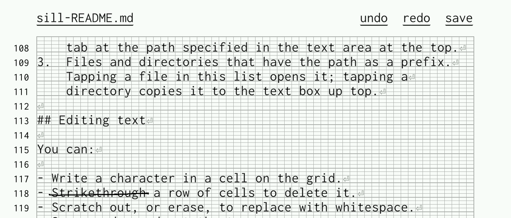

# Sill

**Sill** is a gesture-based [text editor]
(and shell) for the reMarkable tablet.

[text editor]: https://en.wikipedia.org/wiki/Text_editor

## Why a text editor?

The built-in reMarkable notebooks are great for most users
who want to write freeform notes, or sometimes export a
notebook as text.

However, there are a few special situations where a text
editor is essential:

- You want to have precise control over the characters in
  your document. (For example: you're writing a blog post in
  Markdown, or coding a short script.)
- You have an existing text file you want to edit. (Copied
  from your computer, or a system file on the tablet.)

## Why handwriting recognition?

It's already possible to use a normal text editor on
reMarkable, via a terminal emulator like [Yaft] or
[FingerTerm]. These apps use a keyboard for
input, either via an onscreen keyboard or one you've hooked
up to the tablet somehow.

**Sill** is different; you enter characters by handwriting
directly into the document. This has a few advantages:

- Handwriting is fun! If you own a reMarkable, you probably
  enjoy writing things out by hand.
- It can be faster than using an onscreen keyboard: you just
  write out the characters you want on the screen, exactly
  where you want them.
- Operations like deleting text by ~~striking it out~~,
  or filling in whitespace using the eraser, can be
  satisfying and efficient.

However, this all comes at the cost of ambiguity. A
handwritten character is easier to misinterpret than a
button on a keyboard, and Sill needs to work a
bit harder to turn your writing into changes to the text.

## How does the handwriting recognition work?

Sill uses "template-based gesture recognition" to recognize
the individual characters (letters, digits, punctuation,
etc.) that you write. For every character, Sill maintains
a list of _templates_: examples of what that character
looks like when handwritten. When you write a letter on the
tablet, Sill looks through the list of templates to find the
closest match, and inserts the corresponding character into
the document.

Sill displays editable text on a [French-ruled grid],
with one character per cell. The grid makes it easier to
write characters consistently, which in turn makes them
easier for the software to recognize.

[French-ruled grid]: https://en.wikipedia.org/wiki/Ruled_paper#France

# Using Sill

## Editing text

You can:

- Write a character in a cell on the grid.
- Strikethrough a row of cells to delete it.
- Scratch out, or erase, to replace with whitespace.
- Save, undo, redo at the top.
- Draw a carat (vertical line) between cells to open a
  selection. This enters "selection mode".

### Selection mode
- Draw a line from the carat: back to delete, forward
  to add whitespace
- C (copy), V (paste), X (cut) for clipboard stuff

## Main menu

You can open the main menu by tapping the filename or
other text at the top left of the screen. In order,
it includes:
1.  A text area with an absolute filepath. Buttons let you
    create a _new file_ at that path, or open a _new shell_
    with that working directory.
2.  A list of open tabs: files, shells, and the template
    editor. Tap the name to open, or _save as_ to save that
    tab at the path specified in the text area at the top.
3.  Files and directories that have the path as a prefix.
    Tapping a file in this list opens it; tapping a
    directory copies it to the text box up top.

## Managing templates

- Add a template by writing it on the grid.
- Strikethrough or scratch-out to remove a template.
- Templates are added automatically by "corrections" while
  editing.
  - You might need to clean these up!

### Training the character recognizer

Sill ships with a basic set of templates for each character.
However, everyone's handwriting is different, and the
character recognizer may not work well out of the box for
you. Sill is designed to learn your handwriting over time to
understand you better, but it's likely that you'll need to
adjust your writing to make it easier for the tablet
to understand.

A few general suggestions:

- Print, with one character per cell in the grid.
- Try to be consistent with how you write a letter. If you
  write the letter `Y` in several different ways, Sill
  will eventually learn all of them... but sticking
  to a single style makes it easier for Sill to learn,
  faster to recognize, and harder to confuse with other
  characters.
- Avoid [homoglyphs]: make sure different
  characters look different. For example, the built-in
  templates write the capital `I` with the top and bottom
  bars, to make it easier to distinguish from a lower-
  case `l`.
- You can also use vertical position to differentiate
  templates; `'` and `,` look similar, but since they're
  drawn at different heights on the grid, they're easy for
  the system to tell apart.

[homoglyphs]: https://en.wikipedia.org/wiki/Homoglyph

## Shell

- Immutable prefix: old commands, shell output.
- Otherwise all the usual editing commands still work.
- Shell, not a terminal
  - vim etc. won't work
  - no formatting

## Limitations

- UTF8 files, paths, and text streams.
- Small-to-medium files: a few megabytes.
- No tabs.