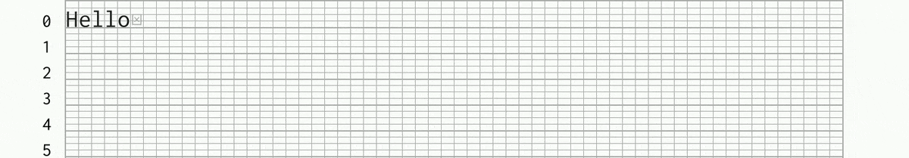
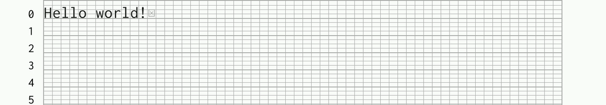
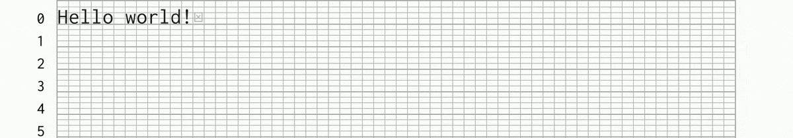
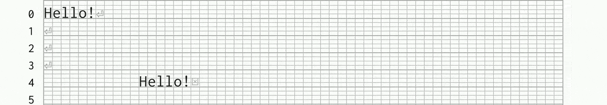
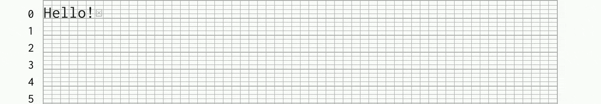
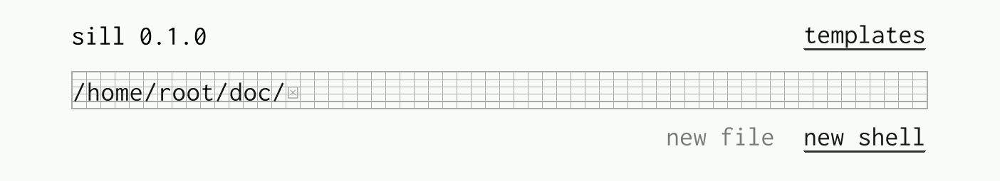
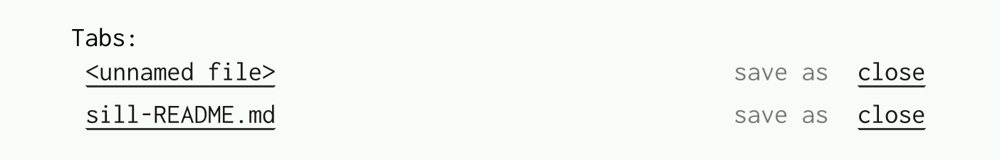
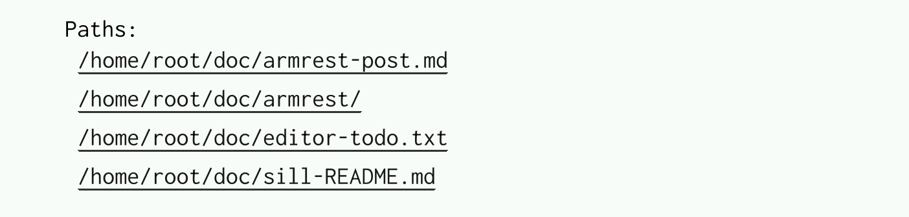
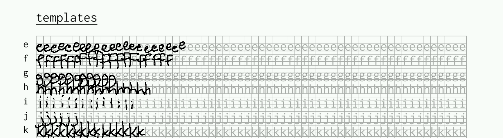

# Sill

**Sill** is a gesture-based [text editor]
(and shell) for the reMarkable tablet.

[text editor]: https://en.wikipedia.org/wiki/Text_editor

## Why a text editor?

The built-in reMarkable notebooks are great for most users
who want to write freeform notes, or sometimes export a
notebook as text.

However, there are a few special situations where a text
editor is essential:

- You want to have precise control over the characters in
  your document. (For example: you're writing a blog post in
  Markdown, or coding a short script.)
- You have an existing text file you want to edit. (Copied
  from your computer, or a system file on the tablet.)

## Why handwriting recognition?

It's already possible to use a normal text editor on
reMarkable, via a terminal emulator like [yaft] or
[fingerterm]. These apps use a keyboard for
input, either via an onscreen keyboard or one you've hooked
up to the tablet somehow.

**Sill** is different; you enter characters by handwriting
directly into the document. This has a few advantages:

- Handwriting is fun! If you own a reMarkable, you probably
  enjoy writing things out by hand.
- It can be faster than using an onscreen keyboard: you just
  write out the characters you want on the screen, exactly
  where you want them.
- Operations like deleting text by ~~striking it out~~,
  or filling in whitespace using the eraser, can be
  satisfying and efficient.

However, this all comes at the cost of ambiguity. A
handwritten character is easier to misinterpret than a
button on a keyboard, and Sill needs to work a
bit harder to turn your writing into changes to the text.

[yaft]: https://github.com/timower/rM2-stuff/tree/master/apps/yaft
[fingerterm]: https://github.com/dixonary/fingerterm-reMarkable

## How does the handwriting recognition work?

Sill uses "template-based gesture recognition" to recognize
the individual characters (letters, digits, punctuation,
etc.) that you write. For every character, Sill maintains
a list of _templates_: examples of what that character
looks like when handwritten. When you write a letter on the
tablet, Sill looks through the list of templates to find the
closest match, and inserts the corresponding character into
the document.

Sill displays editable text on a [French-ruled grid],
with one character per cell. The grid makes it easier to
write characters consistently, which in turn makes them
easier for the software to recognize.

[French-ruled grid]: https://en.wikipedia.org/wiki/Ruled_paper#France

# Using Sill

## Editing text

Sill supports a reasonably broad set of editing operations.
It will try and interpret your gesture as soon as the pen
is lifted away from the screen.

- Write characters on the grid to insert them in the document.
  
  Sill automatically inserts spaces as needed.
- Scratch out, or erase, to replace with whitespace.
  
- Strikethrough a row of cells to delete it.
  

Buttons at the top right of the screen let you _undo_,
_redo_, and _save_ the document.

### Selection mode

Drawing a vertical line "between" cells enters selection mode.
(The line itself is called a **carat**.)
Drawing a second carat will select a span of text.

- Drawing a line from the carat to another point in the document will "move" the following text. If the line goes backward, it deletes the intevening text; if the line goes forward, it adds whitespace. The description sounds a bit complicated, but the behaviour is intuitive: 
  
- Sill supports various single-letter shortcuts in selection mode: just write the letter large anywhere on the grid. This is mostly useful for clipboard opertions: C to copy, V to paste, and X to cut.
  

You can recognize when you're in selection mode because
the grid changes from the usual French grid to an ordinary
grid, without the usual guidelines. (You can't enter text
in this mode, so the guidelines are useless!) 

## Main menu

You can open the main menu by tapping the filename or
whatever text appears at the top left of the screen. In order,
this screen includes:
1. A text area with an absolute filepath.
    
   This path is called the **focus path**. Buttons let you
   create a _new file_ at that path, or open a _new shell_
   with that working directory. A button on the top right opens the _templates_ menu.
2. A list of open tabs: files, shells, and the template
    editor.
    
    Tap the name to open, or _save as_ to save a file at the focus path specified above.
3. Files and directories that have the focus path as a prefix.
   
    Tapping a file in this list opens it; tapping a
    directory replaces the focus path with that directory.

## Managing templates

To open the template editor, tap the _templates_
button at the top left of the main menu.

Add a template by writing it in the correct row on the grid.
Strikethrough or scratch-out a template to remove it. 

Templates are added automatically by "corrections" you make
while editing: if you immediately overwrite a character you just
wrote, Sill understands that it might have guessed it wrong the
first time. It can take Sill some time to learn from its mistakes
like this, though... if Sill is consistently recognizing your
handwriting badly, it's a good idea to open the template editor
and add some templates!

### Training the character recognizer

Sill ships with a basic set of templates for each character.
However, everyone's handwriting is different, and the
character recognizer may not work well out of the box for
you. While Sill is designed to learn your handwriting over time to
understand you better, it's likely that you'll need to
adjust your writing to make it easier for the tablet
to understand.

A few general suggestions:

- Print, with one character per cell in the grid.
- Try to be consistent with how you write a letter. If you
  write the letter `Y` in several different ways, Sill
  will eventually learn all of them... but sticking
  to a single style makes it easier for Sill to learn,
  faster to recognize, and harder to confuse with other
  characters.
- Avoid [homoglyphs]: make sure different
  characters look different. For example, the built-in
  templates write the capital `I` with the top and bottom
  bars, to make it easier to distinguish from a lower-
  case `l`.
- You can also use vertical position to differentiate
  templates; `'` and `,` look similar, but since they're
  drawn at different heights on the grid, they're easy for
  the system to tell apart.

[homoglyphs]: https://en.wikipedia.org/wiki/Homoglyph

## Using the shell

Sill allows you to open a `bash` shell for interacting with
your tablet. This is an experimental feature in an
already-experimental program; caveat haxxor. A few quick
notes:

The shell view mixes the text you write with the shell's
stderr and stdout, similar to how it behaves in a terminal.
The editable part of the text is at the bottom of the text
area, with a French grid behind it; the output of the terminal
and your old commands are at the top, on an ordinary grid,
and can't be modified. You can still copy and paste from the
non-editable part, though.

This is a shell, and not a terminal: there's no formatting,
and terminal-based apps like `vim` or `emacs` won't work.
Nonetheless, quite a lot of command-line tools work fine
in this environment.

# Configuration

Sill can be configured via a
file at `.config/sill/sill.toml`.
For available options, see [the default
config](src/sill.toml).

# Limitations

Sill is experimental software. While it's usable enough
to edit many real-world files, including this README, it's
not as robust as nearly any other text editor you may be
used to.

In particular, Sill can only properly handle:
- UTF8 files, paths, and text streams.
- Small-to-medium files: a few megabytes.

# Building

Sill uses [libremarkable] to interact with the tablet;
see the build instructions in that repo for how to build
a Rust application for the tablet.

[libremarkable]: https://github.com/canselcik/libremarkable
